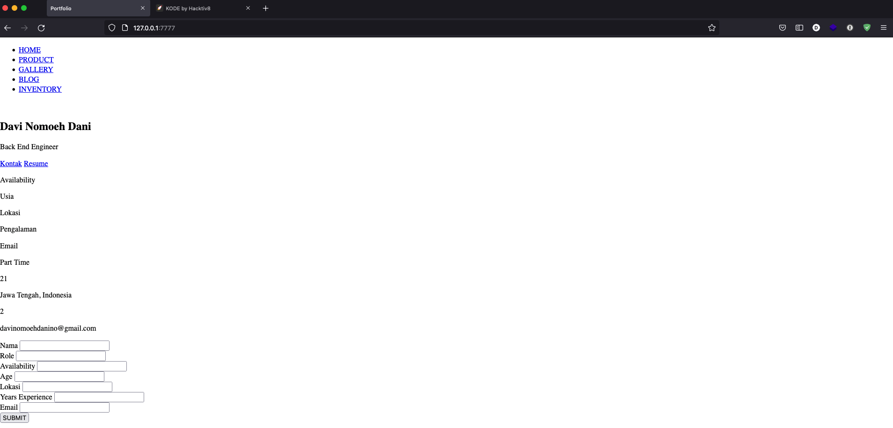
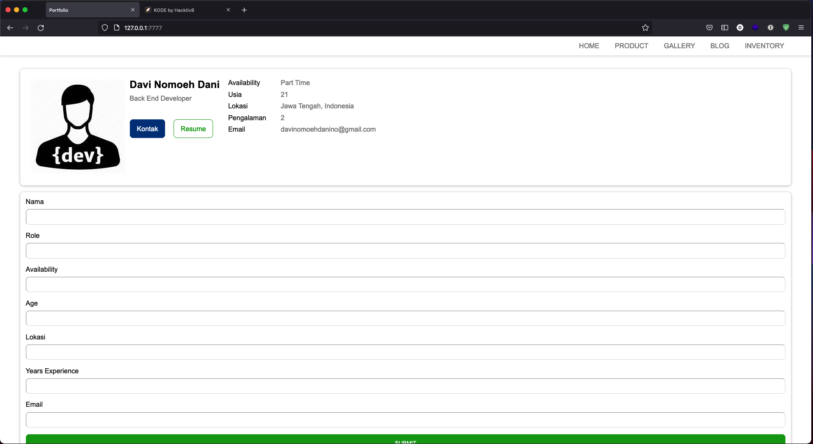

# Assignment 1 - Kampus Merdeka
Simple portfolio's page with HTML + CSS.

## When my life without CSS styles ⚪️


## When you (css) always beside me ✨✨


## Clone and Run
```sh
$ cd Assignment1H8_DaviNomoehDani
$ php -S 127.0.0.1:7777
```

# Requirements
- Text editor: [Visual Studio Code](https://code.visualstudio.com/)
- PHP ^5.*
- Browser